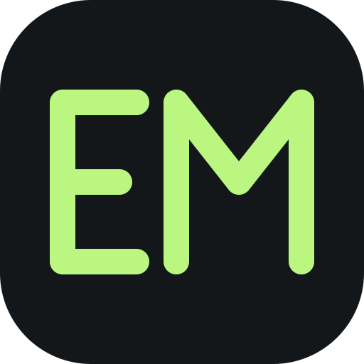

<p align="center">
  
</p>

<h1 align="center">Emdeck</h1>

<p align="center"><strong>Your code. Your agents. One workspace.</strong><br />A lightweight desktop IDE by Erdos Miller.</p>

<p align="center">
  <a href="https://github.com/Erdos-Miller/emdeck/actions/workflows/check.yml"></a>
  <a href="https://github.com/Erdos-Miller/emdeck/releases"></a>
  <a href="LICENSE"></a>
</p>

<p align="center">
  <a href="https://github.com/Erdos-Miller/emdeck/releases"><strong>Download beta</strong></a> ·
  <a href="docs/USAGE.md">User guide</a> ·
  <a href="https://github.com/Erdos-Miller/emdeck/discussions">Feedback &amp; questions</a> ·
  <a href="docs/ROADMAP.md">Roadmap</a> ·
  <a href="CONTRIBUTING.md">Contribute</a>
</p>


<p align="center"><sub>Browser demo with synthetic files and simulated agents.</sub></p>

Emdeck brings your files, Git tools, and terminal agents together without
indexing your project or running background language servers. Open a folder,
edit what you need, and work with the agent CLIs you already use.

## A workspace for agent-driven development

- **Keep agents in view.** Arrange terminal panes, group workspaces, and
  customize activity and available usage details. Launch Claude Code, Codex, or
  your own CLI.
- **Edit without the overhead.** Explore folders on demand, keep files in tabs,
  preview Markdown, and retain your editor history when changing the layout.
- **Work with Git visually.** Browse local and remote branch trees, review diffs
  in tabs, manage worktrees, and resolve conflicts with Ours/Theirs or a manual
  merge.
- **Run your commands.** Discover Bun, npm, pnpm, and Yarn scripts optionally;
  keep custom commands and recent runs in the toolbar.
- **Make it yours.** Choose Dark, Light, or Graphite, adjust accents and fonts,
  and resize or reposition the panels.
- **Connect other machines.** Configure SSH, tmux, cmux, or provider session
  links. The experimental background-session server adds persistent terminals.

Built with **Tauri + Rust**, **React + TypeScript**, **CodeMirror**, and
**xterm.js**. Agent CLIs use your existing installations and accounts. Opening a
project does not start an agent or run a project command.

## Get Emdeck

**[Download an unsigned beta →](https://github.com/Erdos-Miller/emdeck/releases)**

Windows x64 · macOS Apple Silicon / Intel · Ubuntu 24.04 x64

Read the [installation guide](docs/INSTALLATION.md) for requirements, checksums,
and unsigned-build notes. This README describes current source; downloadable
betas may not include every feature yet. See the [changelog](CHANGELOG.md) and
[validation record](docs/VALIDATION.md). Background sessions are experimental
and are not included in the published 0.1.22 beta.

## Help shape Emdeck

| I want to…                          | Start here                                                                                |
| ----------------------------------- | ----------------------------------------------------------------------------------------- |
| Report something broken             | [Bug report](https://github.com/Erdos-Miller/emdeck/issues/new?template=bug.yml)          |
| Request a concrete feature          | [Feature request](https://github.com/Erdos-Miller/emdeck/issues/new?template=feature.yml) |
| Explore an idea or vote on feedback | [Ideas board](https://github.com/Erdos-Miller/emdeck/discussions/categories/ideas)        |
| Ask how something works             | [Questions & answers](https://github.com/Erdos-Miller/emdeck/discussions/categories/q-a)  |
| See accepted and active work        | [Public roadmap](docs/ROADMAP.md)                                                         |
| Report a vulnerability privately    | [Security advisory](https://github.com/Erdos-Miller/emdeck/security/advisories/new)       |

Search before posting, add a reaction to an existing request, and use synthetic
examples. Votes help prioritize work; they are not a delivery promise.

Contributions are welcome through **fork → pull request to `dev` → checks →
maintainer review**. Only designated maintainers can merge; release-ready work
is promoted from `dev` to `main`. See [Contributing](CONTRIBUTING.md),
[Governance](GOVERNANCE.md), and our [Code of Conduct](CODE_OF_CONDUCT.md).

## Build locally

Install Node 22.12+ within Node 22, Bun 1.3.6, stable Rust, Git, and the
[Tauri prerequisites](https://v2.tauri.app/start/prerequisites/).

```sh
bun install --frozen-lockfile
bun run desktop
```

`bun run dev` opens the explicitly labeled browser demo; it has no native file,
Git, or process access. `bun run verify` runs the repository checks and tests.
See [development instructions](CONTRIBUTING.md#development) before opening a PR.

## Explore the docs

[User guide](docs/USAGE.md) · [Merge conflicts](docs/MERGE-CONFLICTS.md) ·
[Remote sessions](docs/REMOTE-SESSIONS.md) ·
[Background sessions](docs/PERSISTENT-AGENTS.md) ·
[Architecture](docs/ARCHITECTURE.md) · [Release process](docs/RELEASE.md) ·
[Privacy](docs/PRIVACY.md)

Emdeck is an independent project inspired by familiar IDE workflows and
[Herdr's approach to agent terminals](https://herdr.dev/). It does not embed VS
Code or Herdr. Licensed under [Apache-2.0](LICENSE); see
[third-party notices](THIRD_PARTY_NOTICES.md).
