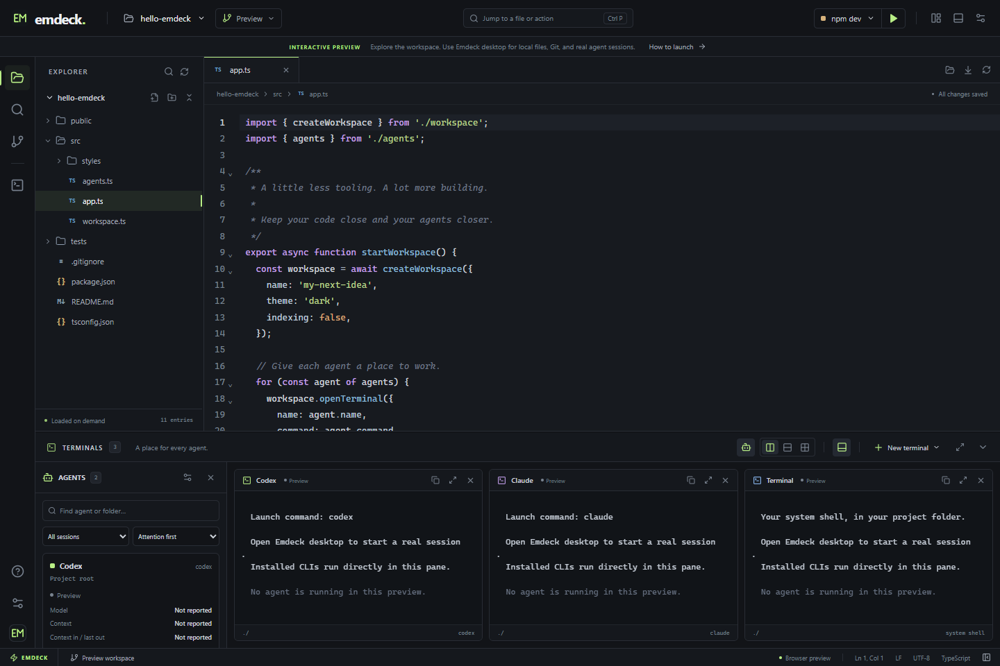

# Emdeck user guide

Your code. Your agents. One workspace.

A lightweight, Apache-2.0 open-source desktop workspace for agent-driven
development by Erdos Miller. Built with **Tauri 2 + Rust**, **React +
TypeScript**, **CodeMirror 6**, and **xterm.js**.

**Unsigned public beta.** Follow the [installation guide](INSTALLATION.md) for
available downloads and platform requirements. Actual completed checks and known
gaps are recorded in [Validation](VALIDATION.md).

Open a project, edit a few files, and keep your terminal agents in view. Emdeck
does not build a project index, run language servers, lint in the background, or
start agents merely because a project was opened.

The unreleased **Background sessions** view uses Emdeck's own optional headless
server to keep local and remote terminal agents running after the IDE closes.
See [setup, automation and current limits](PERSISTENT-AGENTS.md).



Screenshot from the browser demo using synthetic files and simulated agents.

[Contributing](../CONTRIBUTING.md) · [Security](../SECURITY.md) ·
[Privacy](PRIVACY.md) · [Changelog](../CHANGELOG.md) · [License](../LICENSE)

## Run

Install Node.js 22.12+ within Node 22, Bun 1.3.6, stable Rust, Git, and the
[Tauri prerequisites for your platform](https://v2.tauri.app/start/prerequisites/).
Windows requires the Microsoft C++ build tools and WebView2; macOS requires
Xcode command line tools; Linux requires WebKitGTK 4.1 and its development
dependencies.

```sh
bun install --frozen-lockfile
bun run desktop
```

For the **browser preview**:

```sh
bun run dev
```

Open http://127.0.0.1:1420. The browser preview uses a clearly labeled sample
project in local storage. It does not have local filesystem, Git, or process
access. The actual desktop app starts with an Open Project screen.

## What is implemented

| Area            | Features                                                                                                                                                                                                                                                                                                                                                               |
| --------------- | ---------------------------------------------------------------------------------------------------------------------------------------------------------------------------------------------------------------------------------------------------------------------------------------------------------------------------------------------------------------------- |
| Windows         | Reopen last project on startup, independent project windows, new-window opening by default when a project is already open, explicit replacement, per-window filesystem and terminal ownership                                                                                                                                                                          |
| Files           | Open folders, lazy directory expansion, hidden files, loaded-file filter, quick open, create, rename, copy/paste, copy relative/absolute paths, reveal in system file manager, move to system trash                                                                                                                                                                    |
| Editor          | Tabs, dirty indicators, per-tab undo, syntax highlighting for JS/TS/JSX/TSX, JSON, CSS, HTML, Markdown, Python and Rust, find/replace, folding, line numbers, wrap, font size, LF/CRLF preservation                                                                                                                                                                    |
| Markdown        | Formatted Preview, Edit and live Split views, headings, tables, checklists, code blocks, project images, heading anchors and relative document links                                                                                                                                                                                                                   |
| Agent terminals | Real PTYs (ConPTY on Windows), default shell, Codex/Claude/Gemini launch presets, custom agent commands, individual working directories, full-bottom or below-editor placement, side-by-side/stacked/grid layouts, maximize pane, resize panel, restart exited sessions, up to 12 panes                                                                                |
| Git             | Separate local/remote branch trees, nested branch folders and search, branch action menus, incoming/outgoing counts, fetch/push/update, tracking/rename, checkout/create/safe delete, merge/rebase and recovery, staged and working changes, per-file staging/unstaging, commits, recent history, closable diff tabs, conflict marker resolution with ours/theirs/both |
| Worktrees       | Dedicated tab to list worktrees, create from a new or available local branch, choose a local/remote starting branch, open in separate project windows, and safely remove linked worktree folders while keeping their branches                                                                                                                                          |
| Run commands    | Searchable toolbar picker with Recently used / My commands / Detected scripts, Bun/npm/pnpm/Yarn detection, optional automatic discovery, per-project runner override, custom saved commands and working directories, F5 to launch in a dedicated terminal                                                                                                             |
| Appearance      | Dark, Light and Graphite themes, custom accent, editor/terminal font sizes, terminal scrollback, sidebar width and terminal layout persistence                                                                                                                                                                                                                         |
| Platforms       | Windows, macOS and Linux implementations and CI workflows; see validation notes below                                                                                                                                                                                                                                                                                  |

Terminals use CLIs you have already installed and authenticated. Emdeck does not
bundle agents or require its own AI account. Run configurations execute through
the configured shell and are never launched merely by opening a project.

The design takes inspiration from WebStorm's workspace organization and
[Herdr's independent agent terminals](https://herdr.dev/docs/agents/). Emdeck
does not embed Herdr or claim compatibility with its session protocol.

## Agent overview and usage

The terminal toolbar also offers an optional **Workspaces** view: spaces grouped
by working folder or remote connection, session tabs, and attention filtering.
Use the monitor button to configure cmux TUI, tmux, SSH commands, or provider
session links. Connections are always explicit. See
[Terminal workspaces and remote sessions](REMOTE-SESSIONS.md) for setup,
disconnect behavior, and which integrations run inside Emdeck or in a browser.

The **Agents** button in the terminal toolbar shows a searchable session
overview beside the terminals. Filter by provider or attention, sort by
name/launch order/attention, focus a pane, maximize it, rename it, close it, or
restart an exited session. Focusing, filtering, renaming, hiding the overview,
and changing details preserve running terminals.

Use **Customize agent overview** to show/hide and reorder activity, model,
context, input/output tokens, estimated session cost, account limits, and
duration. Reset times are an optional detail within account limits. Compact
cards, shell visibility, Claude usage integration, and Codex refresh frequency
are configurable. These preferences persist across projects and restarts.

- **Claude:** new sessions launched with the plain `claude` preset can report
  model, context, current-context input tokens, latest-response output tokens,
  estimated session cost in USD, and available quota/reset windows through the
  [Claude status-line interface](https://code.claude.com/docs/en/statusline).
  These token counters are not cumulative billed tokens, and the cost estimate
  is not a subscription invoice. Quota fields depend on the CLI version,
  account, and whether a response has completed. The integration applies a
  temporary session-only status line; it does not change saved Claude settings.
  Disable it before launching to keep your usual status line. Custom
  commands/flags do not receive this integration.
- **Codex:** press **Refresh Codex account usage** for quota windows from your
  installed, signed-in CLI through its
  [app-server account interface](https://learn.chatgpt.com/docs/app-server).
  Limits are shared across sessions, not charged to individual panes. Requests
  are read-only, do not start an agent conversation, and cache successful
  responses for 30 seconds. Optional one-minute/five-minute refresh runs only
  while the overview is visible. Model/context can also be detected from
  terminal text; per-session token/cost values are not available through this
  integration.
- **Other CLIs:** Gemini and custom commands retain real terminals.
  Model/context are detected when recognizable terminal output supplies them.
  Unsupported metrics say **Not reported**; missing quotas are never treated as
  zero usage.

Agent activity is a heuristic observation of the live terminal's bottom rows,
with detected labels and explanatory tooltips. Approval prompts with
confirmation choices are highlighted for attention; terminal output alone does
not prove an agent is working. Readings show their source and time; expired
quota windows ask for refresh. Only allowlisted Claude metrics are retained in a
temporary per-session file, removed when the terminal reader exits. No
transcripts or credentials are copied into the overview. Browser preview
sessions remain explicitly marked as previews.

## Everyday workflow

Emdeck reopens the last-used project folder on startup by default. It remembers
successful project opens, the project in a focused window, and the project in a
window you confirm closing. The first launch after upgrading uses your existing
recent-project list. Turn this off in **Settings → Startup → Reopen last project
on startup** to start with the welcome screen. A project explicitly opened in a
new window takes priority over restoration. If the saved folder is unavailable,
the welcome screen shows the error and lets you choose another project.

1. Open your repository's root folder. Expand only the folders you need. Opening
   another project with Ctrl/Cmd+O opens a **new Emdeck window**, keeping your
   current tabs and terminals intact. The project menu also offers **Open
   project in new window…** and **Replace project in this window…**. Recent
   projects follow the same default.
2. Open files with a click. Markdown files open as formatted documents; use
   **Edit**, **Split**, or **Preview** above the document. Split updates from
   unsaved edits, and changing views retains undo history. Use Ctrl/Cmd+S to
   save. The editor preserves line endings.
3. Choose **New terminal → Codex, Claude, Gemini, Terminal, or Custom command**.
   The terminal panel spans the full bottom width beside the narrow icon sidebar
   by default, with the file tree and editor above it. Toggle **Full-width
   terminal panel** in the terminal toolbar, or choose **Settings → Workspace
   layout → Below editor**, to keep the file tree full-height. Drag dividers to
   resize; focused dividers support arrow keys, Home/End, and double-click to
   reset. Placement and sizes are saved. Switching layouts, hiding, and
   maximizing keep terminal sessions running.
4. Use **Source Control** for diffs, staging, and commits. Click the branch chip
   for separate, collapsible **Local branches** and **Remote branches**
   sections. Names like `team/fix/branch-name` appear as nested folders. Search
   matches full paths and expands matching folders. Local branches support
   switch/create/merge/delete; deletion uses `git branch -d`, so unmerged work
   is protected. Clicking a remote branch creates a local tracking branch, and
   its merge action merges the remote ref into your current branch. Git refuses
   to overwrite an existing local branch. Remote branches reflect your last
   fetch; use **Fetch** to update them. Emdeck does not fetch automatically.
5. Open **Resolve conflicts…** in Source Control or the branch menu. Select a
   file, accept Ours/Theirs, or edit the result in the three-pane manual merge
   view. Applying a result stages that file; continuing the operation is
   explicit. Binary files and deletions support whole-side choices. See
   [Merge conflict resolution](MERGE-CONFLICTS.md) for safeguards and limits.
6. Open the run dropdown in the top bar. **Recently used** shows your latest
   launches, **My commands** holds your custom configurations, and **Detected
   scripts** reads the project's package scripts. Click an entry to select it
   for Run/F5, or use its play button to launch immediately. Add/edit/remove
   custom commands and copy a detected script into a custom command from the
   same picker. F5 also works with a terminal focused.

## Git worktrees

Open **Source Control → Worktrees → Manage**, or **branch menu → Manage
worktrees…**. The Worktrees tab shows each folder and branch, identifying the
main checkout, this window, other open Emdeck windows, detached HEADs, locked
worktrees, and missing folders. It loads on demand without project indexing or a
background polling loop.

**New worktree** can create a branch from the current committed HEAD or a
selected local/remote branch. Alternatively, select an existing local branch;
branches already checked out in any worktree are disabled. Choose a new
destination folder whose parent exists, outside other worktrees; the default is
a sibling of this project. Creating from a remote branch uses Git's tracking
behavior. Current uncommitted edits stay in the original project. The optional
**Open in a new window after creating** setting is enabled by default, and
existing worktrees also offer **Open in new window**. Each window keeps its own
files, terminals, and project settings.

**Remove…** confirms the exact folder, removes it through `git worktree remove`,
and keeps its branch. There is no force-removal option. Main/current worktrees,
locked worktrees, and worktrees open in this Emdeck process cannot be removed;
Git also refuses dirty or untracked files and worktrees with submodules. Ignored
files are removed with the folder. Window protection covers windows in the same
Emdeck process, not other applications or separately launched Emdeck processes.
Use Git in a terminal for locking, unlocking, moving, repairing, or pruning
stale registrations. See the
[Git worktree manual](https://git-scm.com/docs/git-worktree) for those commands.

## Git diff tabs

The branch dropdown keeps local and remote branches in separate folder trees.
Click or right-click a branch to open its submenu beside the list: checkout,
create from that branch, checkout and update/rebase, compare, merge/rebase,
create a worktree, update, push, change tracking, rename, and safe local
deletion. The tree and search stay visible while actions are open.
Context-specific actions are disabled where they do not apply. Right Arrow opens
a branch's submenu; Left Arrow or Escape closes it and returns focus to that
branch. Up/Down and Home/End navigate actions. An open submenu follows a
different branch after a short hover; filtering, collapsing folders, or
scrolling the tree dismisses it. Menus reposition to fit the window.

**Fetch** refreshes all configured remotes and prunes deleted remote references.
Blue **↓** numbers show incoming commits and **↑** numbers show outgoing commits
relative to each local branch's tracked branch. Counts come from locally cached
Git refs, as described in the
[Git reference documentation](https://git-scm.com/docs/git-for-each-ref); they
do not contact remotes on a timer. A missing tracked branch is labeled **gone**.
**Push…** lets you review the source and select a configured remote and
destination branch. It pushes only that branch, without force or tags, and makes
the destination its tracked branch.

**Update** fetches the tracked branch and fast-forwards when possible. Updating
an inactive local branch keeps your current checkout in place. Divergent
histories require an explicit merge or rebase. Branches checked out in another
worktree must be updated there. **Checkout and Update** leaves the selected
branch checked out, including if the update subsequently fails. Merge/rebase
start with a clean working tree; unsaved editor buffers are protected and there
is no automatic stash. Source Control exposes **Continue** and **Abort** during
a merge/rebase; abort discards conflict-resolution edits made during that
operation. The same application process serializes Git mutations across windows
sharing a repository; external Git clients remain outside this coordination.

**Compare with…** opens a regular editor tab with the patch and up to 50 unique
commits from each branch, alongside the full commit counts. **Show Diff with
Working Tree** compares the selected branch with saved tracked files, including
staged changes; it excludes untracked files and unsaved editor buffers.
Comparisons are read-only and keep existing editor tabs. Text diffs have a 2 MB
viewer limit.

Clicking a tracked change in Source Control opens a read-only diff in the
regular editor tab strip. Working and Staged changes have separate labels, and
clicking the same change reuses its tab. Close it with the tab's × or
Ctrl/Cmd+W. **Open in editor** returns to the editable file without discarding
existing edits. **Refresh diff** and **Refresh Git** update the active
comparison; returning to a diff also reloads saved changes. Inactive diff tabs
keep their scroll position without background Git reads. Conflicted files open
the merge dialog; untracked files open in the editor.

## Markdown documents

Markdown preview supports `.md`, `.markdown`, `.mdown`, and `.mkd` files,
including uppercase extensions. It uses
[react-markdown](https://github.com/remarkjs/react-markdown) and
[remark-gfm](https://github.com/remarkjs/remark-gfm), loaded when the preview is
opened. Relative links open files inside the current project; heading links
scroll the preview; HTTP/HTTPS links open the system browser. Local PNG, JPEG,
GIF, WebP, SVG, AVIF, ICO and BMP images use the same project access checks as
files and have a 5 MB limit. Remote images load when you select **Load image**.
Embedded HTML is displayed as text rather than executed. Documents larger than
one million characters remain available in Edit without rendering a preview.
View choices are retained for the currently open tabs.

## Script detection and run preferences

Automatic detection reads `package.json` and the names of files in the project
root when a project opens, the run picker opens, or you press **Refresh detected
scripts**. It does not traverse subprojects or install dependencies. Use a
custom command with a working directory for nested packages.

The script runner is selected from `packageManager`, then
`devEngines.packageManager`, then a matching lockfile: `bun.lock` / `bun.lockb`,
`pnpm-lock.yaml`, `yarn.lock`, or `package-lock.json` / `npm-shrinkwrap.json`.
Bun configuration/runtime hints are used when no stronger signal exists; npm is
the final fallback. Conflicting lockfiles without a declaration prompt you to
choose a runner in the picker. A manual **Script runner** choice takes priority
and is saved for that project. Detected commands use the explicit
`bun run <script>` form for Bun, as described in
[Bun's script documentation](https://bun.com/docs/runtime#run-a-packagejson-script).

Turn **Auto-detect project scripts** on/off in the picker or Settings → Run
commands. This setting applies to all projects. Turning it off removes detected
entries from the picker and history view while retaining your custom commands.
Script metadata errors and names that cannot be safely imported are explained in
the Detected scripts section; unusual names can be run using a custom command.

Custom commands, the selected command, runner override, and the eight most
recent distinct launches are saved per project. **Clear** in Recently used
clears history. Customizing a detected script creates an independent copy under
My commands. Existing custom commands and edited presets from older Emdeck
releases are preserved; unchanged legacy generated npm presets are detected
afresh.

If an agent edits an open file, Emdeck refreshes it when the window regains
focus or you press Refresh. A dirty buffer is retained and an external-change
banner appears. Saves compare the original content revision before replacing the
file. You can reload the disk version or preserve your buffer in a new file. The
revision check substantially reduces accidental overwrites, but cannot provide
transactional locking against unrelated external writers.

Closing a pane ends its terminal session. Closing an Emdeck window ends only
that window's sessions; other windows stay open. Hiding or maximizing panels
keeps sessions mounted and running. Deliberately detached/background processes
can outlive their shell. The optional Background sessions view supports
persistent detach/reattach; see [Session server](PERSISTENT-AGENTS.md). Ordinary
terminal panes remain owned by their desktop window. Agent activity labels are
detected from terminal text; connection, recent output, exit, and error describe
the terminal itself.

## Performance approach

- Directory reads are shallow and triggered by folder expansion or
  explicit/focus refresh. There is no recursive file watcher or background scan.
- Only open files are parsed for syntax highlighting. There are no language
  servers, type checkers, completion engines, or project-wide analyzers.
- Editor languages and terminal UI are loaded on demand. Agent observations are
  coalesced on terminal output and inspect at most 28 live rows. No
  project/transcript scanning is added. Visible session durations/reset labels
  update every 15 seconds; account quota polling is opt-in and pauses when the
  overview is hidden.
- Git commands run on demand and on window focus; Git itself still performs the
  filesystem work needed to calculate status.
- PTY output streams through Tauri channels. Terminal scrollback defaults to
  3,000 lines per pane and is configurable.
- Text files are limited to 5 MB; binary/non-UTF-8 files are rejected. Diff
  views are limited to 2 MB. Folder copying is explicit and may take time for
  large directories.
- Tauri uses the OS webview instead of shipping a browser runtime. Actual
  CPU/RAM usage depends on open files, terminal output, and the agents you
  launch; no benchmark claim is made.

## Keyboard shortcuts

| Action                          | Shortcut                |
| ------------------------------- | ----------------------- |
| Open project                    | Ctrl/Cmd+O              |
| Open project in new window      | Ctrl/Cmd+Shift+O        |
| Quick open loaded files/actions | Ctrl/Cmd+P              |
| Save / close file               | Ctrl/Cmd+S / Ctrl/Cmd+W |
| Find / replace in editor        | Ctrl/Cmd+F / Ctrl/Cmd+H |
| Toggle explorer                 | Ctrl/Cmd+B              |
| Toggle terminal panel           | Ctrl/Cmd+`              |
| Settings                        | Ctrl/Cmd+,              |
| Run configuration               | F5                      |
| Copy selected terminal text     | Ctrl/Cmd+Shift+C        |

## Build and test

```sh
bun run verify
bun run desktop:build
```

Browser tests use Microsoft Edge on Windows and Chromium on macOS/Linux. Install
Chromium with `bunx playwright install chromium` on those systems. Native
integration tests use isolated temporary directories and Git repositories, never
your open project. The PTY test launches a real shell, answers terminal protocol
requests, resizes it, and verifies output and exit.

For just the Windows installer:

```sh
bun run tauri build --bundles nsis
```

Artifacts are written to `src-tauri/target/release/` and
`src-tauri/target/release/bundle/`. The manual **Package Emdeck** GitHub
workflow produces separate Windows, Apple Silicon/Intel macOS and Linux
artifacts. The draft release workflow runs checks before packaging and attaching
checksums. Signing/notarization requires organization credentials; unsigned
previews are explicitly labeled. See [Release process](RELEASE.md) for setup and
actual validation requirements. Auto-update is not enabled.

## Source layout

```text
src/app/              Workspace composition and lifecycle controllers
src/features/         Agents, editor, explorer, Git, projects, runs and settings
src/shared/           Plain contracts, neutral utilities and shared UI
src/platform/         Typed desktop transport, browser preview and storage
src/styles/           Ordered styles by feature and layout
src-tauri/src/        Native commands, services and window-owned state
tests/unit/           In-memory service behavior
tests/integration/    Real Bun execution in an isolated temporary folder
tests/e2e/            Browser workflows against a fixed production build
scripts/              Dependency, IPC registration and code-size checks
.github/workflows/    Four-target checks, audits, packaging and draft releases
```

See [Architecture and repository standards](ARCHITECTURE.md) for ownership, the
Erdos Miller conventions adopted here, dependency rules and validation.

Settings, recent projects, panel dimensions and run commands are stored in the
local webview profile. File contents stay local unless you run a Git push, a
terminal agent, or another command that sends them. Terminal agents and user-run
commands retain their own permissions and network behavior. The filesystem API
confines file operations to explicitly opened roots and rejects traversal and
symlink escapes. Git metadata and project roots are protected from file
mutations. Symlink copy/rename/trash is delegated to the system file manager.

This beta does not provide complete WebStorm feature parity. Remote branch
deletion, force push, advanced worktree operations (move/lock/prune), an
extension system, global indexed search and debugger integration are not
implemented. Background-session capabilities and limits are documented in
[Session server](PERSISTENT-AGENTS.md).

Development builds were previously named Relay and Veldri. The application
retains `dev.relay.ide` and `relay:` preference keys to preserve existing local
settings. See [Installation and upgrades](INSTALLATION.md) before removing an
older installation. [Third-party notices](../THIRD_PARTY_NOTICES.md) accompany
the source and installers.
